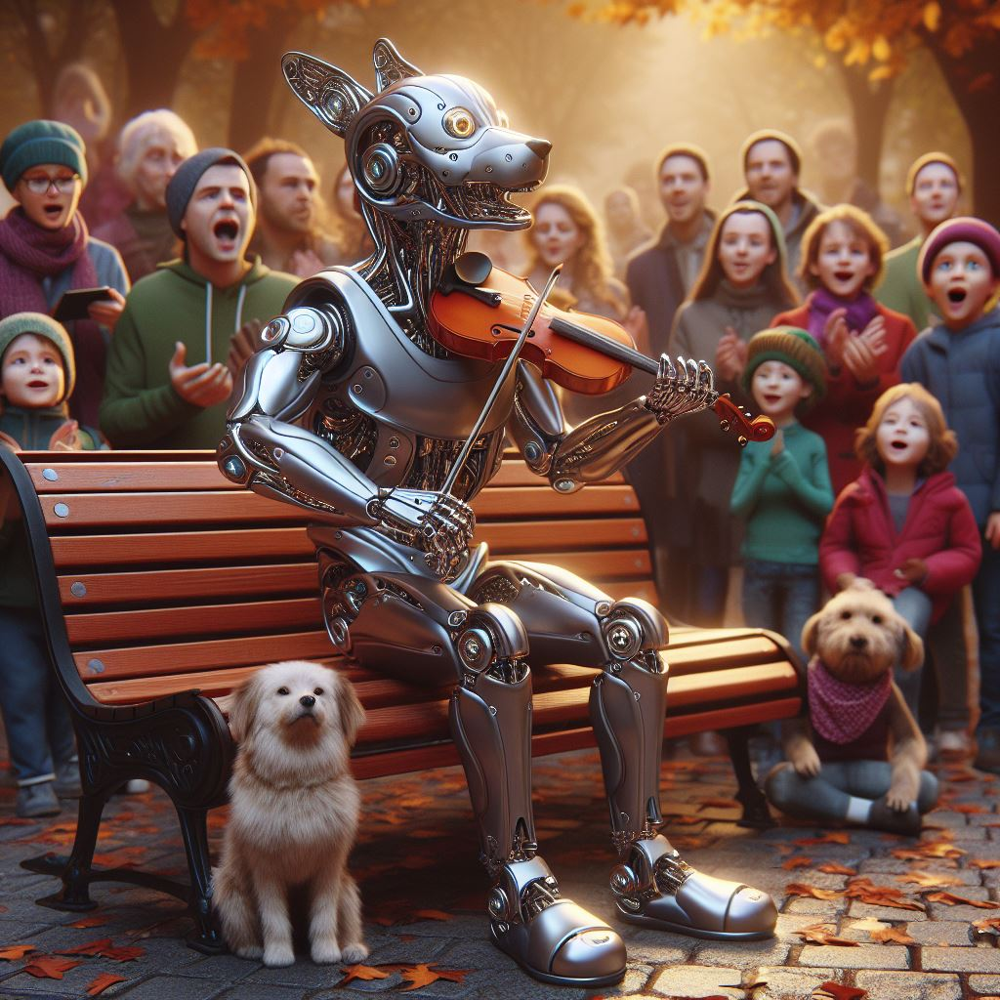

# 逻辑非智能
2024.03.21

看见一个关于机器狗的视频，

机器狗站在几个桩子上，用脚敲击桩顶，伴随着一段乐曲。

有一种解读认为说机器狗可以演奏音乐了。

不往配音的方向讨论。这个音乐的确是机器人的敲打发出来的。

可以说机器人可以演奏音乐了吗？

机器人的敲击动作不是程序设定的吗？

机器人的行为由程序确定，不具有“智能”，就不能算是表演了吗？

人类学习音乐，不断练习，不就是相当于一个设定的过程吗？

人类的许多“智能”行为，不也是预先设定的吗？

真正的差别，用一句话解释，

“讲故事需要逻辑，生活不需要逻辑”。

机器人的行为由逻辑决定，人类的行为不由逻辑决定。

